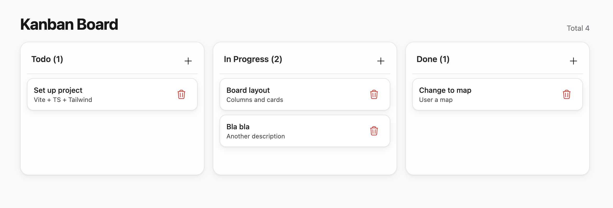

# Kanban Board

A modern, responsive Kanban board application built with React, TypeScript, and Tailwind CSS. This project provides an intuitive drag-and-drop interface for managing tasks across different stages of completion.

## Features

- **Drag & Drop Interface**: Seamlessly move tasks between columns using the @dnd-kit library
- **Three Column Layout**: Organize tasks into Todo, In Progress, and Done columns
- **Task Management**: Create, edit, and delete tasks with detailed descriptions
- **Local Storage**: Tasks are automatically saved to your browser's local storage
- **Responsive Design**: Works perfectly on desktop and mobile devices
- **Modern UI**: Clean, accessible interface built with Tailwind CSS and Headless UI
- **TypeScript**: Full type safety throughout the application
- **Error Handling**: Robust error boundaries and loading states

## Screenshot



## Tech Stack

- **Frontend**: React 18 with TypeScript
- **Styling**: Tailwind CSS
- **Drag & Drop**: @dnd-kit/core, @dnd-kit/sortable
- **UI Components**: Headless UI, Heroicons
- **Build Tool**: Vite
- **Testing**: Vitest, Testing Library
- **Linting**: Biome
- **Package Manager**: pnpm

## Getting Started

### Prerequisites

- Node.js (version 18 or higher)
- pnpm (recommended) or npm

### Installation

1. Clone the repository:
```bash
git clone <repository-url>
cd kanban-board
```

2. Install dependencies:
```bash
pnpm install
```

3. Start the development server:
```bash
pnpm dev
```

4. Open your browser and navigate to `http://localhost:5173`

### Available Scripts

- `pnpm dev` - Start the development server
- `pnpm build` - Build the application for production
- `pnpm preview` - Preview the production build locally
- `pnpm test` - Run the test suite
- `pnpm lint` - Check code for linting issues
- `pnpm format` - Format code using Biome
- `pnpm lint:fix` - Fix linting issues automatically

## Project Structure

```
src/
├── components/          # React components
│   ├── Board.tsx       # Main board component with drag & drop
│   ├── Column.tsx      # Individual column component
│   ├── TaskCard.tsx    # Task card component
│   └── TaskDialog.tsx  # Task creation/editing dialog
├── buttons/            # Reusable button components
├── data/              # Sample data and initial state
├── hooks/             # Custom React hooks
│   └── useLocalStorage.tsx
├── types.ts           # TypeScript type definitions
└── App.tsx            # Main application component
```

## Usage

1. **View Tasks**: Tasks are organized into three columns: Todo, In Progress, and Done
2. **Move Tasks**: Drag and drop tasks between columns to update their status
3. **Add Tasks**: Click the plus button in any column to create a new task
4. **Delete Tasks**: Click the trash icon on any task card to remove it
5. **Edit Tasks**: Click on a task to edit its details (if edit functionality is implemented)

## Data Persistence

The application uses the browser's local storage to persist your tasks. Your data will be saved automatically and restored when you reload the page.

## Contributing

1. Fork the repository
2. Create a feature branch: `git checkout -b feature-name`
3. Make your changes and add tests if applicable
4. Run the linter: `pnpm lint:fix`
5. Run tests: `pnpm test`
6. Commit your changes: `git commit -m 'Add some feature'`
7. Push to the branch: `git push origin feature-name`
8. Submit a pull request

## License

This project is licensed under the MIT License - see the LICENSE file for details.

## Acknowledgments

- Built with [@dnd-kit](https://dndkit.com/) for drag and drop functionality
- UI components from [Headless UI](https://headlessui.com/)
- Icons from [Heroicons](https://heroicons.com/)
- Styled with [Tailwind CSS](https://tailwindcss.com/)
